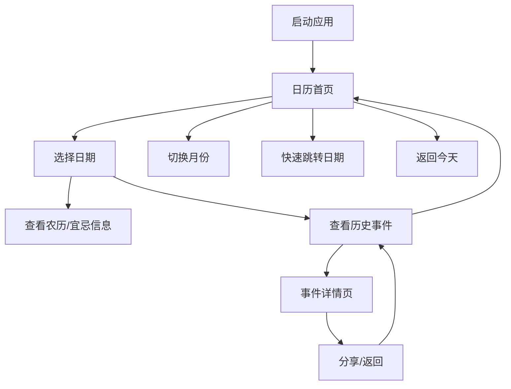

# History Today - 产品需求文档 V2.0（历史+万年历）

## 1. 产品概述

### 1.1 产品定位
History Today 是一款集**历史上的今天**与**万年历**于一体的综合性日历应用。用户不仅可以查看传统农历、黄历信息，还能了解历史上今天发生的重大事件，实现日历查询与历史学习的完美结合。

### 1.2 目标用户
| 用户群体 | 特征描述 | 核心需求 |
|----------|----------|----------|
| 历史爱好者 | 对历史有浓厚兴趣 | 丰富的历史内容、深度的历史解读 |
| 传统文化爱好者 | 关注农历、节气、黄历 | 准确的农历信息、宜忌查询 |
| 日常规划者 | 需要查看日期、安排日程 | 清晰的日历视图、日期切换 |
| 知识学习者 | 学生、教师等 | 便捷的知识获取、历史学习 |

### 1.3 产品价值
- **实用价值**：提供准确的公历、农历、节气、宜忌信息
- **知识价值**：提供准确、丰富的历史事件数据
- **文化价值**：传承传统文化，弘扬历史知识
- **体验价值**：简洁优雅的界面设计，流畅的交互体验

---

## 2. 核心功能

### 2.1 功能模块架构

```
History Today
├── 万年历模块
│   ├── 日历视图（月视图/周视图）
│   ├── 农历信息展示
│   ├── 节气节日显示
│   ├── 黄历宜忌
│   └── 日期快速切换
├── 历史上的今天模块
│   ├── 事件时间线
│   ├── 分类筛选
│   ├── 事件详情
│   └── 日期关联
└── 系统模块
    ├── 数据管理
    ├── 本地存储
    └── 设置
```

### 2.2 页面结构

| 页面名称 | 功能描述 | 优先级 |
|----------|----------|--------|
| **日历首页** | 万年历主界面，展示月视图/周视图、农历、节气、宜忌 | P0 |
| **历史事件页** | 展示选中日期对应的历史事件时间线 | P0 |
| **事件详情页** | 展示事件完整信息 | P0 |
| **日期选择器** | 快速跳转到指定日期 | P1 |
| **设置页** | 应用设置、关于 | P2 |

### 2.3 万年历功能详情

#### 2.3.1 日历首页

| 模块名称 | 功能描述 | 优先级 |
|----------|----------|--------|
| **顶部导航** | 显示当前年月，左右箭头切换月份，点击展开日期选择器 | P0 |
| **月视图** | 网格形式展示整月日期，高亮今天、选中日期 | P0 |
| **周视图** | 横向展示一周七天，支持左右滑动切换周 | P1 |
| **农历信息** | 显示选中日期的农历日期、干支、生肖 | P0 |
| **节气节日** | 显示当日节气或传统节日 | P0 |
| **黄历宜忌** | 显示当日宜做/忌做事项 | P0 |
| **历史事件入口** | 显示当日历史事件数量，点击进入事件页 | P0 |
| **快速返回今天** | 悬浮按钮或底部按钮快速回到今天 | P1 |

#### 2.3.2 日历交互

| 交互元素 | 交互方式 | 反馈效果 |
|----------|----------|----------|
| 日期格子 | 点击 | 选中日期，更新下方信息 |
| 月份切换 | 点击箭头/左右滑动 | 切换上/下月 |
| 日期选择器 | 点击年月标题 | 弹出年月选择器 |
| 周视图滑动 | 左右滑动手势 | 切换上/下周 |

### 2.4 历史事件功能详情

#### 2.4.1 历史事件页

| 模块名称 | 功能描述 | 优先级 |
|----------|----------|--------|
| **日期头部** | 显示公历日期、农历日期、星期 | P0 |
| **分类筛选** | 横向滚动标签：全部、政治、科技、文化、体育、战争、人物 | P0 |
| **事件时间线** | 按年份倒序展示历史事件 | P0 |
| **事件卡片** | 年份、标题、简短描述、缩略图 | P0 |
| **空状态** | 无事件时显示友好提示 | P1 |
| **日期切换** | 左右滑动切换前一天/后一天 | P1 |

#### 2.4.2 事件详情页

| 模块名称 | 功能描述 | 优先级 |
|----------|----------|--------|
| **头部导航** | 返回按钮、分类标签、分享按钮 | P0 |
| **事件标题** | 大标题展示 | P0 |
| **事件元信息** | 年份、日期、分类 | P0 |
| **事件图片** | 相关历史图片 | P1 |
| **详细描述** | 事件背景、经过、影响 | P0 |
| **相关事件** | 同分类或同日期的其他事件 | P2 |

---

## 3. 交互流程

### 3.1 核心用户流程



### 3.2 页面跳转关系

| 起始页面 | 目标页面 | 触发方式 | 转场动画 |
|----------|----------|----------|----------|
| 日历首页 | 历史事件页 | 点击"历史事件"入口 | 底部滑入 |
| 日历首页 | 日期选择器 | 点击年月标题 | 底部弹出 |
| 历史事件页 | 事件详情页 | 点击事件卡片 | 右进左出 |
| 事件详情页 | 历史事件页 | 点击返回/手势返回 | 左进右出 |
| 日历首页 | 设置页 | 点击设置图标 | 右进左出 |

---

## 4. 用户界面设计

### 4.1 设计规范

#### 4.1.1 色彩系统

| 用途 | 颜色值 | 说明 |
|------|--------|------|
| **主色调** | #1e3a5f | 深蓝色，用于标题、重点元素 |
| **辅助色** | #4a90d9 | 亮蓝色，用于按钮、链接 |
| **强调色** | #e74c3c | 红色，用于今天标记、重要提示 |
| **背景色** | #f8f9fa | 浅灰白，主背景 |
| **卡片背景** | #ffffff | 白色，卡片背景 |
| **农历色** | #8b4513 | 棕色，农历文字 |
| **宜（吉）** | #27ae60 | 绿色，宜做事项 |
| **忌（凶）** | #e74c3c | 红色，忌做事项 |
| **文字主色** | #333333 | 深灰，正文 |
| **文字次色** | #666666 | 中灰，辅助文字 |
| **分割线** | #e0e0e0 | 浅灰，分割线 |
| **选中高亮** | #1e3a5f | 深蓝色，选中状态 |

#### 4.1.2 字体规范

| 层级 | 字号 | 字重 | 用途 |
|------|------|------|------|
| 大标题 | 32sp | Bold | 年月标题 |
| 标题1 | 24sp | Bold | 页面标题 |
| 标题2 | 20sp | Medium | 日期数字 |
| 标题3 | 18sp | Medium | 农历日期 |
| 正文 | 16sp | Regular | 详细描述 |
| 辅助文字 | 14sp | Regular | 宜忌、节气 |
| 小字 | 12sp | Regular | 星期、标签 |
| 极小字 | 10sp | Regular | 角标、提示 |

#### 4.1.3 间距规范

| 场景 | 数值 | 说明 |
|------|------|------|
| 页面边距 | 16dp | 左右边距 |
| 卡片内边距 | 16dp | 卡片内部间距 |
| 元素间距 | 8dp | 相邻元素间距 |
| 模块间距 | 16dp | 大模块间距 |
| 日历格子间距 | 4dp | 日期格子间隙 |
| 圆角 | 12dp | 卡片圆角 |
| 按钮圆角 | 8dp | 按钮圆角 |

### 4.2 页面设计

#### 4.2.1 日历首页布局

```
┌─────────────────────────────────────────┐
│  Status Bar                              │
├─────────────────────────────────────────┤
│  [←] 2025年5月      [今日] [设置]        │  ← 顶部导航 (56dp)
├─────────────────────────────────────────┤
│  日    一    二    三    四    五    六  │  ← 星期栏 (40dp)
├─────────────────────────────────────────┤
│                                         │
│  28    29    30     1     2    [3]    4 │  ← 月视图
│        初十  十一   十二  十三  十四   十五│     (可左右滑动)
│                                         │
│  ...                                  │
│                                         │
├─────────────────────────────────────────┤
│  ┌─────────────────────────────────┐    │
│  │  5月3日 星期六                  │    │
│  │  农历四月初六 乙巳年 蛇年        │    │  ← 日期信息卡
│  │  立夏 · 青年节                  │    │     (120dp)
│  └─────────────────────────────────┘    │
├─────────────────────────────────────────┤
│  ┌─────────────────────────────────┐    │
│  │  宜：出行 搬家 签订合同 交易     │    │  ← 宜忌卡
│  │  忌：开业 动土 安葬             │    │     (80dp)
│  └─────────────────────────────────┘    │
├─────────────────────────────────────────┤
│  ┌─────────────────────────────────┐    │
│  │  📜 历史上的今天 (12条)   [→]   │    │  ← 历史事件入口
│  └─────────────────────────────────┘    │
├─────────────────────────────────────────┤
│         [🏠 返回今天]                   │  ← 底部按钮
└─────────────────────────────────────────┘
```

#### 4.2.2 日历格子设计

```
普通日期格子          今天格子            选中格子
┌─────────┐         ┌─────────┐         ┌─────────┐
│   15    │         │   3     │         │   5     │
│  十八   │         │  初六   │         │  初八   │
│         │         │  ●今天  │         │  ●选中  │
└─────────┘         └─────────┘         └─────────┘

有事件标记格子       节气/节日格子
┌─────────┐         ┌─────────┐
│   5     │         │   5     │
│  初八   │         │  立夏   │
│  ●3条   │         │  节日   │
└─────────┘         └─────────┘
```

#### 4.2.3 历史事件页布局

```
┌─────────────────────────────────────────┐
│  [←] 5月3日 星期六  农历四月初六  [分享] │  ← 顶部导航
├─────────────────────────────────────────┤
│  [全部][政治][科技][文化][体育][战争][人物]│  ← 分类筛选
├─────────────────────────────────────────┤
│                                         │
│  ●─────┬──────────────────────────┐     │
│  1945  │  第二次世界大战欧洲战场   │     │
│        │  结束，德国签署无条件     │     │  ← 事件时间线
│        │  投降书...               │     │
│        │  [政治] 📷               │     │
│        └──────────────────────────┘     │
│                                         │
│  ●─────┬──────────────────────────┐     │
│  1919  │  五四运动爆发            │     │
│        │  北京学生游行示威...      │     │
│        │  [政治]                  │     │
│        └──────────────────────────┘     │
│                                         │
└─────────────────────────────────────────┘
```

#### 4.2.4 事件详情页布局

```
┌─────────────────────────────────────────┐
│  [←] [政治]                   [分享] [收藏]│  ← 顶部导航
├─────────────────────────────────────────┤
│                                         │
│        第二次世界大战欧洲战场结束        │  ← 标题
│        1945年5月3日                     │  ← 日期
│                                         │
│  ┌─────────────────────────────────┐    │
│  │                                 │    │  ← 事件图片
│  │      历史事件相关图片            │    │
│  │                                 │    │
│  └─────────────────────────────────┘    │
│                                         │
│  1945年5月3日，德国最高统帅部代表在柏林  │  ← 详细描述
│  卡尔斯霍斯特的苏军司令部签署了无条件投  │
│  降书，标志着第二次世界大战欧洲战场的正  │
│  式结束...                             │
│                                         │
├─────────────────────────────────────────┤
│  📅 同日期其他事件                       │  ← 相关推荐
│  ┌─────────────────────────────────┐    │
│  │ 1919年 - 五四运动爆发           │    │
│  └─────────────────────────────────┘    │
└─────────────────────────────────────────┘
```

### 4.3 交互细节

| 交互元素 | 交互方式 | 反馈效果 |
|----------|----------|----------|
| 日期格子 | 点击 | 水波纹效果，选中状态更新 |
| 月份切换 | 点击箭头 | 日历滑动切换动画 |
| 日历滑动 | 左右手势 | 平滑切换到上/下月 |
| 历史事件入口 | 点击 | 底部滑入事件页 |
| 事件卡片 | 点击 | 水波纹效果，跳转详情页 |
| 分类标签 | 点击 | 背景色变化，列表刷新 |
| 返回今天 | 点击 | 日历平滑滚动到今天 |

---

## 5. 数据需求

### 5.1 数据模型

```kotlin
// 历史事件
data class HistoryEvent(
    val id: String,                    // 唯一标识
    val title: String,                 // 事件标题
    val date: String,                  // 日期 (MM-DD格式)
    val year: Int,                     // 年份
    val category: EventCategory,       // 分类
    val description: String,           // 详细描述
    val shortDesc: String,             // 简短描述
    val imageUrl: String?,             // 图片URL
    val createdAt: Long,               // 创建时间
    val updatedAt: Long                // 更新时间
)

// 农历信息
data class LunarInfo(
    val lunarDate: String,             // 农历日期（如：四月初六）
    val lunarYear: String,             // 农历年份（如：乙巳年）
    val zodiac: String,                // 生肖（如：蛇）
    val ganZhi: String,                // 干支（如：乙巳）
    val solarTerm: String?,            // 节气（如：立夏）
    val festival: String?,             // 节日（如：青年节）
    val yi: List<String>,              // 宜做事项
    val ji: List<String>               // 忌做事项
)

// 日历日期
data class CalendarDay(
    val date: LocalDate,               // 公历日期
    val lunarInfo: LunarInfo,          // 农历信息
    val isToday: Boolean,              // 是否今天
    val isSelected: Boolean,           // 是否选中
    val eventCount: Int                // 历史事件数量
)

// 事件分类
enum class EventCategory {
    ALL, POLITICS, TECH, CULTURE, SPORTS, WAR, PEOPLE;
    
    fun getDisplayName(): String = when (this) {
        ALL -> "全部"
        POLITICS -> "政治"
        TECH -> "科技"
        CULTURE -> "文化"
        SPORTS -> "体育"
        WAR -> "战争"
        PEOPLE -> "人物"
    }
    
    fun getColor(): Color = when (this) {
        ALL -> Color.Gray
        POLITICS -> Color(0xFF1e3a5f)
        TECH -> Color(0xFF3498db)
        CULTURE -> Color(0xFF9b59b6)
        SPORTS -> Color(0xFFe67e22)
        WAR -> Color(0xFFc0392b)
        PEOPLE -> Color(0xFF27ae60)
    }
}
```

### 5.2 数据量预估

| 数据类型 | 预估数量 | 说明 |
|----------|----------|------|
| 历史事件 | 3,000+ | 每天约10条，覆盖全年366天 |
| 农历数据 | 200年 | 1900-2100年农历数据 |
| 节气数据 | 24个/年 | 二十四节气 |
| 节日数据 | 50+ | 传统节日+现代节日 |
| 宜忌数据 | 200年 | 每日宜忌 |
| 图片资源 | 500+ | 部分事件配图 |

### 5.3 数据来源方案

| 方案 | 说明 | 优先级 |
|------|------|--------|
| 本地算法 | 农历计算算法（已验证的开源算法） | P0 |
| 本地JSON | 历史事件数据内置 | P0 |
| 本地数据库 | Room数据库存储所有数据 | P0 |
| 远程API | 后端服务提供数据接口（预留） | P2 |

---

## 6. 技术要求

### 6.1 性能指标

| 指标 | 目标值 | 说明 |
|------|--------|------|
| 启动时间 | ≤ 1.5s | 冷启动到首页可交互 |
| 日历切换 | ≤ 200ms | 月份切换动画时间 |
| 页面切换 | ≤ 300ms | 页面跳转动画时间 |
| 列表滚动 | 60fps | 事件列表流畅度 |
| 内存占用 | ≤ 120MB | 正常运行时内存使用 |
| 包体积 | ≤ 25MB | APK安装包大小 |

### 6.2 兼容性要求

| 项目 | 要求 |
|------|------|
| 最低Android版本 | Android 7.0 (API 24) |
| 目标Android版本 | Android 14 (API 34) |
| 屏幕适配 | 支持手机、平板 |
| 屏幕方向 | 竖屏优先，支持横屏 |

### 6.3 离线支持

- 农历计算完全离线，无需网络
- 历史事件数据本地存储
- 图片资源按需加载，支持缓存
- 上次浏览日期本地记忆

---

## 7. 未来规划

### 7.1 版本迭代计划

| 版本 | 核心功能 | 预计时间 |
|------|----------|----------|
| v1.0 | 万年历基础、历史事件浏览 | 第一阶段 |
| v1.1 | 日程提醒、事件收藏 | 第二阶段 |
| v1.2 | 每日推送、桌面小组件 | 第三阶段 |
| v1.3 | 历史事件搜索、分享功能 | 第四阶段 |
| v2.0 | 用户系统、评论互动 | 第五阶段 |

### 7.2 待评估功能

- 日程提醒与待办事项
- 历史事件搜索
- 用户收藏/书签
- 每日推送通知
- 桌面小组件（日历+今日事件）
- 深色模式
- 多语言支持
- 社交分享
- 历史事件收藏夹
- 日期计算工具（日期间隔、日期推算）

---

## 8. 附录

### 8.1 农历算法说明

使用已验证的农历计算算法，支持：
- 公历与农历互转
- 二十四节气计算
- 干支纪年计算
- 生肖计算
- 农历闰月处理

### 8.2 分类定义

| 分类标识 | 分类名称 | 颜色 | 说明 |
|----------|----------|------|------|
| all | 全部 | #808080 | 所有类型事件 |
| politics | 政治 | #1e3a5f | 政治事件、政策发布 |
| tech | 科技 | #3498db | 科技发明、技术突破 |
| culture | 文化 | #9b59b6 | 文化艺术、文学作品 |
| sports | 体育 | #e67e22 | 体育赛事、纪录打破 |
| war | 战争 | #c0392b | 战争事件、军事冲突 |
| people | 人物 | #27ae60 | 名人诞辰、逝世 |

### 8.3 更新日志

| 版本 | 日期 | 更新内容 |
|------|------|----------|
| v1.0 | 2026-05-03 | 初始版本，基础功能定义 |
| v2.0 | 2026-05-03 | 增加万年历功能，整合历史事件 |
